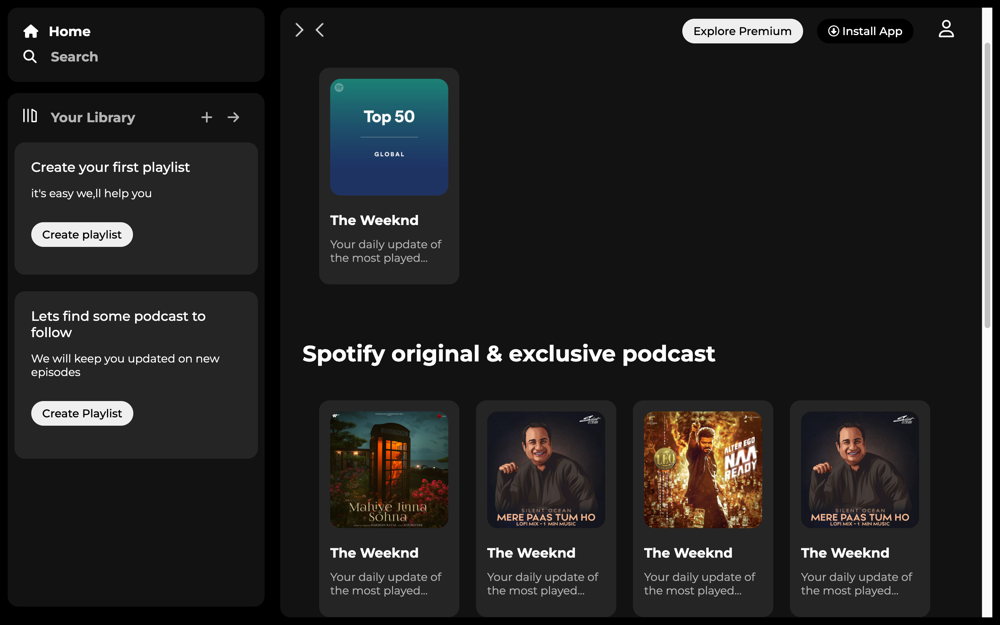

# Spotify Clone

## Description

The Spotify Clone project is a simple web application created to enhance front-end development skills. It emulates the appearance and basic functionality of the Spotify music player using HTML and CSS.

## Technologies Used

- HTML
- CSS

## Setup

To run this project locally:

1. Clone the repository to your local machine:

   
   git clone https://github.com/Shinan007/spotify-clone.git
   

2. Navigate to the project folder:

   cd spotify-clone

3. Open the `index.html` file in your favorite code editor (e.g., Visual Studio Code).

4. You can preview the project by opening `index.html` in your web browser.

## Usage

The Spotify Clone project provides a basic interface that emulates the Spotify music player. Users can explore and interact with the UI to get a feel for the Spotify player's appearance and layout.

## Contributing

Contributors are welcome! If you'd like to contribute to this project by adding functionality or improving its design, please follow these steps:

1. Fork the project to your GitHub account.
2. Create a new branch for your contributions:

   git checkout -b feature/Shinan007

3. Make your changes and commit them with descriptive messages.
4. Push your changes to your forked repository.
5. Create a pull request to merge your changes into the main project.

## License

This project is open-source and available under an open-source license. 

## Acknowledgments

Special thanks to Apana College for teaching me web development.

## Contact

If you have any questions or would like to get in touch, feel free to contact me:

- Phone: 9634879999
- LinkedIn: [www.linkedin.com/in/sharad-chauhan-24a62126a](www.linkedin.com/in/sharad-chauhan-24a62126a)
